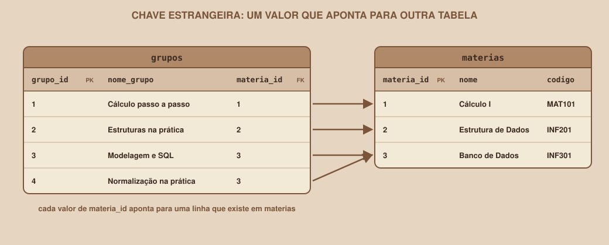

# Module 08, Data Types and Keys

🇧🇷 [Português](../docs/08-tipos-de-dados-e-chaves.md) · 🇺🇸 English

`WEEK 04 // Data Modeling`

---

## // Before you start

The ERD is drawn and checked up to 3NF. What is left is deciding the details the database needs to create each table: the **type** of each column and the **keys** that link and protect the data. It is the step from the logical level to the physical level of the model, and it completes the design before any SQL.

## // The problem: the database needs to know what each column stores

A JavaScript array accepts anything in any position. A relational database is the opposite: each column has a declared **type**, and the database rejects whatever does not match. This is an advantage, because mistakes that would go unnoticed in the array (text where there should be a number) are stopped at the door.

## // The most used types in PostgreSQL

| Type | Stores | Used in the project |
|---|---|---|
| `text` | Text of any length | `nome_usuario`, `nome_grupo`, `local` |
| `integer` | Regular whole number | `max_participantes` |
| `smallint` | Small whole number | `dia_semana` |
| `bigint` | Large whole number | the identifiers (`usuario_id`, `grupo_id`) |
| `boolean` | True or false | (not used this week) |
| `date` | A date, without time | `entrou_em` |
| `time` | A time of day, without date | `hora_inicio` |
| `timestamptz` | An exact instant in time (stored in UTC) | `criado_em` |
| `numeric` | Exact decimal number (money values, for example) | (not used this week) |

Two tips that save headaches. In PostgreSQL, `text` is not slower than `varchar(n)`, so use `text` and, if you need to limit the length, do it with a `check` constraint. And, to represent a real moment in time, generally prefer `timestamptz` over `timestamp`: PostgreSQL interprets the given time zone, converts the instant to UTC internally and shows it according to the time zone set for the session. Notice that it stores the **instant**, not the original time zone that was typed.

## // Primary key

> **PRIMARY KEY: IN PLAIN WORDS**
> It is the column (or set of columns) whose value uniquely identifies each row. It is never empty and never repeats.

There are two ways to choose the primary key:

- **Natural key:** a piece of data that already exists and is unique in the real world, such as the email. The risk is that real data changes: if a person changes their email, every table that references it would need to be updated.
- **Artificial (surrogate) key:** a number generated by the database itself, with no meaning in the real world. It never needs to change, and it is the safest choice.

The project uses artificial keys, generated like this:

```sql
usuario_id  bigint generated always as identity primary key
```

`generated always as identity` asks the database to number each new row by itself (1, 2, 3, ...). It is the standard SQL format, and replaces the old `serial` that still shows up in tutorials.

> **IDENTITY CAN SKIP NUMBERS**
> The `identity` counter never goes back. If an `insert` fails, the number that would have been used is discarded, and the next row gets the following one. That is why a table can have ids 1, 2, 5, 6. This is normal and does not indicate any problem: the id is for identifying, not for counting.

The `participacoes` table uses a **composite primary key**, made of two columns. The pair `(usuario_id, grupo_id)` identifies each row, and at the same time prevents the same person from joining the same group twice.

## // Foreign key

> **FOREIGN KEY: IN PLAIN WORDS**
> It is the column that stores the identifier of a row in another table, and that the database forces to point to a row that really exists.

<div align="center">

</div>

In the declaration, the foreign key uses the word `references`:

```sql
materia_id  bigint not null references materias (materia_id)
```

With that, the database checks the link on every operation. Trying to insert a group with a subject that does not exist results in an error:

```
ERROR:  insert or update on table "grupos" violates foreign key constraint "grupos_materia_id_fkey"
DETAIL:  Key (materia_id)=(999) is not present in table "materias".
```

The database also protects the opposite direction. Deleting a subject that still has groups is refused:

```
ERROR:  update or delete on table "materias" violates foreign key constraint "grupos_materia_id_fkey" on table "grupos"
DETAIL:  Key (materia_id)=(1) is still referenced from table "grupos".
```

### > What happens on delete: `on delete`

For each foreign key, you decide what to do when the row it points to is deleted:

| Option | Effect | Where the project uses it |
|---|---|---|
| (default) | Refuses to delete while there are rows pointing to it | `grupos` pointing to `materias` |
| `on delete cascade` | Also deletes the rows that point to it | `participacoes` and `encontros` pointing to `grupos` |
| `on delete set null` | Keeps the rows, but empties the column that pointed | (not used this week) |

The choice follows the meaning of the data: without the group, its memberships and meetings make no sense and can disappear along with it. A subject with groups, on the other hand, should not be deleted by accident, and the database prevents it.

## // Other constraints

Besides keys, each column can have rules that the database always enforces:

| Constraint | What it guarantees | Example in the project |
|---|---|---|
| `not null` | The column is never empty | `nome_usuario` |
| `unique` | No value repeats in the column | `email` |
| `default` | Value used when nothing is given | `criado_em` gets `now()` |
| `check` | A condition every value must meet | `max_participantes > 0` |

When a rule is broken, the database refuses the operation and says which one it was:

```
ERROR:  duplicate key value violates unique constraint "usuarios_email_key"
DETAIL:  Key (email)=(ana.martins@exemplo.com) already exists.

ERROR:  new row for relation "grupos" violates check constraint "grupos_max_participantes_check"

ERROR:  null value in column "nome_usuario" of relation "usuarios" violates not-null constraint
```

These messages are the protection at work: they prevent, in the database, the problems that the `script.js` array let through.

## // The project's naming convention

- Tables in the **plural** (`usuarios`), columns in the **singular** (`nome_usuario`).
- Everything lowercase, with words separated by `_`, **no accents**, so you never need quotes in commands.
- Each table's primary key is called `<table in singular>_id`, and the foreign key that points to it uses the same name (`materia_id` in `materias` and in `grupos`).

> **ABOUT THE PORTUGUESE NAMES**
> The tables and columns of the example project keep their Portuguese names, so they match the SQL scripts in `docs/example/`: `usuarios` (users), `materias` (subjects), `grupos` (groups), `participacoes` (memberships), `encontros` (meetings).

## // The project's data dictionary

The data dictionary gathers, in a single place, the type and constraints of each column. It is the document that connects the ERD to the SQL of the next module:

| Table | Column | Type | Constraints |
|---|---|---|---|
| usuarios | `usuario_id` | bigint | primary key, identity |
| usuarios | `nome_usuario` | text | not null |
| usuarios | `email` | text | not null, unique |
| usuarios | `criado_em` | timestamptz | not null, default now() |
| materias | `materia_id` | bigint | primary key, identity |
| materias | `nome` | text | not null, unique |
| materias | `codigo` | text | not null, unique |
| grupos | `grupo_id` | bigint | primary key, identity |
| grupos | `nome_grupo` | text | not null |
| grupos | `materia_id` | bigint | not null, references materias |
| grupos | `max_participantes` | integer | not null, default 10, check greater than 0 |
| grupos | `criado_em` | timestamptz | not null, default now() |
| participacoes | `usuario_id` | bigint | composite primary key, references usuarios, cascade |
| participacoes | `grupo_id` | bigint | composite primary key, references grupos, cascade |
| participacoes | `entrou_em` | date | not null, default current_date |
| encontros | `encontro_id` | bigint | primary key, identity |
| encontros | `grupo_id` | bigint | not null, references grupos, cascade |
| encontros | `dia_semana` | smallint | not null, check between 1 and 7 (1 = Monday) |
| encontros | `hora_inicio` | time | not null |
| encontros | `local` | text | not null |

## // Good example × bad example

**Bad example**: a date stored as text:

```
date (text):   '10/09/2026'   '15/08/2026'   '9/09/2026'
sorted:        10/09/2026     15/08/2026     9/09/2026
```

Sorted as text, "10/09" comes before "15/08" and "9/09", because the database compares character by character. Besides, nothing prevents storing "31/02/2026".

**Good example**: the `date` type:

```
date (date):   2026-08-15   2026-09-09   2026-09-10
```

The database understands the date, sorts it in calendar order and rejects dates that do not exist.

## // Common mistakes

| Mistake | Why it happens | How to fix it |
|---|---|---|
| Using `text` for everything | It is the type that accepts anything | Choose the type that represents the data: `date` for dates, `integer` for quantities |
| Using the email as the primary key | It seems natural, since it is unique | Use an artificial id and keep the email as `unique` |
| Being surprised by gaps in the ids | `identity` discards numbers from failed operations | Remember that the id is for identifying, not for counting |
| Forgetting `not null` on required foreign keys | The database accepts the empty column | If the relationship is required (minimum 1), add `not null` |
| Forgetting `on delete` | The default refuses to delete | Decide, for each foreign key, whether the right thing is to refuse or to delete in cascade |

## // Guided practice

1. Take your project's ERD and, for each column, choose the type.
2. Mark each table's primary key and decide whether it is artificial or natural.
3. For each foreign key, decide the `on delete` and justify it in one sentence.
4. List the `not null`, `unique` and `check` constraints your project needs.
5. Build the data dictionary in the same format as the table in this section.

## // Practice on your own

> **CHALLENGE**
> In the library from the previous modules, the loan stores a pick-up date and an expected return date. Which `check` would you create to guarantee that the return is never before the pick-up? Write the condition in one line.

## // Applying it to the week's project

1. Save your project's data dictionary in `docs/arquitetura.md`, in the "Data dictionary" section.
2. Check that each relationship in the ERD has its foreign key in the dictionary.
3. Commit: `git commit -m "Add the project's data dictionary"`.

## // Checkpoint

> **BEFORE MOVING ON, THINK ABOUT THIS**
> Why would using `email` as the primary key of the `usuarios` table be a risk, even though it is unique?

Answer: because the primary key is copied into the foreign keys of other tables (as in `participacoes`), and an email can change. If a person changes their email, the value would need to be changed in every table that references it, and any failure would leave orphan data. An artificial id never changes, and the email stays protected by the `unique` constraint.

## // Module summary

- [ ] I can choose the right type for each column.
- [ ] I know the difference between a natural key and an artificial key, and what `identity` is.
- [ ] I know what a composite primary key is and when to use it.
- [ ] I can declare a foreign key and choose the `on delete`.
- [ ] I can use `not null`, `unique`, `default` and `check`.
- [ ] I have my project's data dictionary.

---

**Next module:** `09-sql-creating-the-tables.md`, the design is complete, with types and keys. Time to turn it into real tables.

`Study Material // Coffee & Code`
