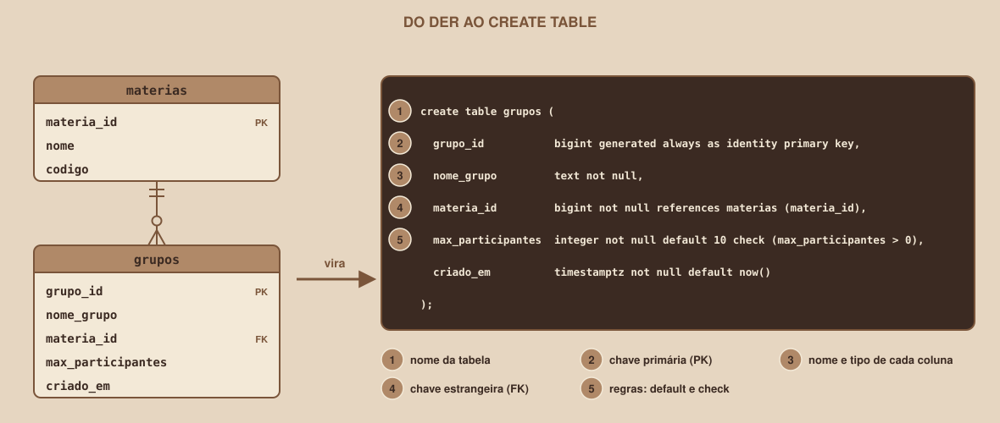

# Module 09, SQL: Creating the Tables

🇧🇷 [Português](../docs/09-sql-criando-as-tabelas.md) · 🇺🇸 English

`WEEK 04 // Data Modeling`

---

## // Before you start

You have the ERD and the data dictionary. This module turns both into real tables, in your Supabase project, using the SQL language. It is the moment the design becomes a database.

## // The problem: how to "tell" the database what to create

The database does not read your drawing. It accepts commands written in SQL, and it is through them that you describe each table, each column and each rule. The good news is that the data dictionary from Module 08 already contains everything the command needs.

## // What SQL is

> **SQL: IN PLAIN WORDS**
> It is the language used to talk to a relational database. It is declarative: you describe **what** you want, and the database decides **how** to do it.

SQL commands are divided into families, according to what they do:

| Family | What it is for | Commands | Where it appears |
|---|---|---|---|
| DDL | Defining the database structure | `create`, `alter`, `drop` | This module |
| DML | Changing the data | `insert`, `update`, `delete` | Module 10 |
| DQL | Querying the data | `select` | Modules 10 and 11 |

## // Anatomy of a `create table`

Look at the `materias` table, the simplest one in the project:

```sql
create table materias (
  materia_id  bigint generated always as identity primary key,
  nome        text not null unique,
  codigo      text not null unique
);
```

The command reads almost like a sentence:

1. `create table materias`: create a table called `materias`.
2. Inside the parentheses, one column per line, separated by commas: the **name**, the **type** and the **constraints**.
3. `primary key`, `not null` and `unique` are the constraints from the data dictionary.
4. The command ends with a semicolon.

In a table with a foreign key, the column gets `references`:

<div align="center">

</div>

## // Order matters: the referenced table comes first

A foreign key needs to point to a table that **already exists**. If you try to create `grupos` before `materias`, the database refuses:

```
ERROR:  relation "materias" does not exist
```

The rule is to create first the tables that nobody references, and then the ones that depend on them. In the project, the order is this:

1. `materias` (depends on nothing)
2. `usuarios` (depends on nothing)
3. `grupos` (depends on `materias`)
4. `participacoes` (depends on `usuarios` and `grupos`)
5. `encontros` (depends on `grupos`)

## // The project's complete script

This is the script that creates the whole database. It is also in the file `docs/example/sql/01-schema.sql`:

```sql
create table usuarios (
  usuario_id    bigint generated always as identity primary key,
  nome_usuario  text not null,
  email         text not null unique,
  criado_em     timestamptz not null default now()
);

create table materias (
  materia_id  bigint generated always as identity primary key,
  nome        text not null unique,
  codigo      text not null unique
);

create table grupos (
  grupo_id           bigint generated always as identity primary key,
  nome_grupo         text not null,
  materia_id         bigint not null references materias (materia_id),
  max_participantes  integer not null default 10 check (max_participantes > 0),
  criado_em          timestamptz not null default now()
);

create table participacoes (
  usuario_id  bigint not null references usuarios (usuario_id) on delete cascade,
  grupo_id    bigint not null references grupos (grupo_id) on delete cascade,
  entrou_em   date not null default current_date,
  primary key (usuario_id, grupo_id)
);

create table encontros (
  encontro_id  bigint generated always as identity primary key,
  grupo_id     bigint not null references grupos (grupo_id) on delete cascade,
  dia_semana   smallint not null check (dia_semana between 1 and 7),
  hora_inicio  time not null,
  local        text not null
);

alter table usuarios       enable row level security;
alter table materias       enable row level security;
alter table grupos         enable row level security;
alter table participacoes  enable row level security;
alter table encontros      enable row level security;
```

The last five lines turn on the RLS that Module 02 explained. It is the layer that decides which rows the Supabase API can see, and turning it on for every exposed table is the recommended security practice.

## // Running the script on Supabase

1. Open your project's **SQL Editor** and create a new query.
2. Paste the complete script and run it.
3. Open the **Table Editor** and confirm that the five tables show up in the list.
4. Click on each table and check that the columns and types match the data dictionary.

## // Fixing a mistake: `alter` and `drop`

If you notice a problem after creating, there are two paths. To **add or remove a column**, use `alter table`:

```sql
alter table grupos add column descricao text;
alter table grupos drop column descricao;
```

To **delete a whole table**, use `drop table`:

```sql
drop table encontros;
```

> **CAREFUL WITH `DROP`**
> `drop table` deletes the table and all its data, with no confirmation and no way back. Right now, with the database empty, recreating it is harmless. With real data, the right path is migrations, which Module 14 introduces in the veteran track.

## // Good example × bad example

**Bad example**: creating the tables only by clicking in the Table Editor:

Clicks work, but they leave no trace. A month from now, nobody knows exactly what was done, and recreating the database in another project means repeating everything from memory.

**Good example**: creating with an SQL script, saved in the repository:

```
sql/
├── 01-schema.sql
└── 02-seed.sql
```

The script is the exact documentation of the database: it can be read, versioned in Git and run again in any project, with the same result.

## // Common mistakes

| Mistake | Why it happens | How to fix it |
|---|---|---|
| `relation "materias" does not exist` | The referenced table has not been created yet | Create first the tables nobody references |
| `syntax error at or near ...` | A missing comma, parenthesis or word | Reread the command: each column ends with a comma, except the last one |
| `relation "materias" already exists` | Running the same `create table` twice | Check the Table Editor before repeating, or delete the table with `drop table` if you are starting over |
| Forgetting the semicolon between commands | In a script with several commands, it separates one from the other | End each command with `;` |
| Forgetting `enable row level security` | The database accepts the table without it | Run `alter table ... enable row level security` for each table |

## // Guided practice

1. Write, in a file `sql/01-schema.sql` in your repository, your project's complete script, following the data dictionary.
2. Check the order in which the tables are created.
3. Paste the script into the Supabase SQL Editor and run it.
4. Open the Table Editor and confirm that all tables and columns were created.
5. Compare the Table Editor with your ERD: do the tables and links match?

## // Practice on your own

> **CHALLENGE**
> Add a `descricao text` column to the `grupos` table, using `alter table`. Then remove the column. Check in the Table Editor, after each command, what changed.

## // Applying it to the week's project

1. Save `01-schema.sql` in the repository, in a `sql/` folder.
2. Confirm, on Supabase, that the tables exist and that RLS is on for all of them.
3. Commit: `git commit -m "Add the table creation script"`.

## // Checkpoint

> **BEFORE MOVING ON, THINK ABOUT THIS**
> Why does the `participacoes` table need to come after `usuarios` and `grupos` in the script, while the `materias` table can come at any point before `grupos`?

Answer: because `participacoes` has two foreign keys, one to `usuarios` and another to `grupos`, and each one can only point to a table that already exists. `materias` points to nobody, so it only needs to exist before whoever references it, which is `grupos`.

## // Module summary

- [ ] I know what SQL is and the three families of commands (DDL, DML and DQL).
- [ ] I can write a `create table` with columns, types and constraints.
- [ ] I know why the creation order matters.
- [ ] I ran the script in the SQL Editor and checked the tables in the Table Editor.
- [ ] I can use `alter table` and I know the risk of `drop table`.

---

**Next module:** `10-sql-inserting-and-querying.md`, the tables exist, but they are empty. Time to add data and run the first queries.

`Study Material // Coffee & Code`
