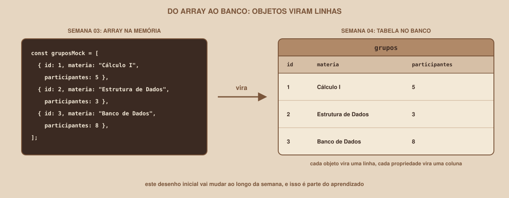

# Módulo 00, Comece Aqui

`SEM 04 // Modelagem de Dados`

---

## // Bem-vindo à Semana 04

Se você seguiu a Semana 03, as telas do Buscador de Grupos de Estudo já reagem, validam e renderizam listas. Agora faça um teste: abra o Perfil, saia de um grupo e depois recarregue a página. O grupo está de volta. Nada do que a pessoa fez ficou guardado.

Isso não é falha do que você construiu, e é exatamente onde a Semana 03 disse que ia parar. Os dados moram em arrays dentro do `script.js`, na memória do navegador, e desaparecem toda vez que a página recarrega. Para durar de verdade, eles precisam morar em um banco de dados.

## // O que muda a partir de agora

Cada objeto do array vira uma linha de uma tabela, e cada propriedade vira uma coluna. Mas esse "vira" esconde a parte difícil: quais tabelas devem existir, como elas se ligam entre si, e como evitar guardar a mesma informação em dois lugares. É disso que trata uma semana de modelagem de dados.

## // O que você vai construir até o fim da semana

- Um DER (diagrama entidade-relacionamento) do Buscador de Grupos de Estudo, mostrando as tabelas e como elas se relacionam.
- O modelo revisado pelas regras de normalização (1FN, 2FN e 3FN), para não repetir informação.
- Scripts SQL que criam as tabelas e inserem os dados que antes viviam no `gruposMock`.
- Um banco PostgreSQL hospedado no Supabase, com as tabelas criadas e dados dentro, visíveis no painel.

## // O que ainda fica de fora

> **AINDA NÃO NESTA SEMANA**
> A página web continua usando os dados mock da Semana 03: ligar o front-end ao banco fica para depois. Também não entram login de verdade nem regras de acesso por usuário (as políticas de segurança do banco). Esta semana é sobre desenhar e criar o banco, não sobre consumi-lo por uma aplicação.

## // Por que um banco relacional, e por que PostgreSQL

> **BANCO RELACIONAL: EM PALAVRAS SIMPLES**
> É um banco que guarda os dados em tabelas (linhas e colunas) e permite ligar uma tabela à outra por meio de chaves, para que cada informação exista em um único lugar.

O **PostgreSQL** é um banco relacional de código aberto, muito usado no mercado. O **Supabase** é uma plataforma que entrega um PostgreSQL pronto na nuvem, com um painel visual para criar e consultar tabelas, então você não precisa instalar nada no seu computador.

> **UM AVISO SOBRE O PLANO GRATUITO**
> No plano gratuito do Supabase, um projeto sem nenhuma atividade por uma semana é pausado, e alguém precisa reativá-lo manualmente no painel. Os dados não se perdem, mas o banco fica fora do ar até a reativação. Se você for entregar o trabalho depois de alguns dias parado, abra o projeto antes e confirme que está ativo. O Módulo 02 mostra como.

## // As duas trilhas

**Se você está começando**, nunca escreveu uma linha de SQL nem desenhou um diagrama de banco. O caminho principal assume isso: os Módulos 01 a 12 apresentam cada conceito antes de ele ser necessário, com foco em desenhar o DER e escrever os scripts SQL das tabelas.

**Se você já tem experiência**, já mexeu com bancos antes. Os Módulos 13 a 15, claramente identificados como trilha veterano e posicionados depois do conteúdo essencial, cobrem índices, migrations e ORMs (Prisma e SQLAlchemy).

Você modela os dados do Buscador de Grupos de Estudo, o mesmo projeto das semanas anteriores. O que muda entre as duas trilhas é a profundidade.

## // Mapa da Semana 04

| Módulo | Conteúdo | Você vai conseguir |
|---|---|---|
| 01 | Por que um banco relacional | Explicar o que um banco resolve que um array não resolve |
| 02 | PostgreSQL e Supabase | Criar o projeto e rodar a primeira consulta |
| 03 | Entidades e atributos | Descobrir quais tabelas o projeto precisa |
| 04 | Relacionamentos e cardinalidade | Ligar entidades com 1:1, 1:N e N:N |
| 05 | O diagrama DER | Desenhar o modelo completo do projeto |
| 06 | Normalização: anomalias e 1FN | Reconhecer os problemas de uma tabela única |
| 07 | Normalização: 2FN e 3FN | Eliminar repetição separando tabelas |
| 08 | Tipos de dados e chaves | Escolher o tipo de cada coluna e as chaves |
| 09 | SQL: criando as tabelas | Transformar o DER em scripts `CREATE TABLE` |
| 10 | SQL: inserindo e consultando | Gravar e buscar dados com `INSERT` e `SELECT` |
| 11 | SQL: JOIN e agregações | Cruzar tabelas e contar resultados |
| 12 | Projeto guiado | Ter o banco ativo no Supabase, com dados |
| 13 | Índices e desempenho (veterano) | Acelerar consultas e entender o plano de execução |
| 14 | Migrations (veterano) | Versionar mudanças no esquema do banco |
| 15 | ORMs: Prisma e SQLAlchemy (veterano) | Mapear tabelas para objetos de código |

Cada módulo é um arquivo independente, mas foram escritos para serem lidos nesta ordem: o desenho (DER e normalização) vem antes do SQL, como num projeto de verdade, porque criar tabelas sem desenhar antes costuma terminar em tabelas refeitas depois.

---

**Próximo módulo:** `01-por-que-um-banco-relacional.md`, antes de desenhar qualquer tabela, entenda o que um banco resolve que um array não resolve.

`Material de Estudo // Coffee & Code`
