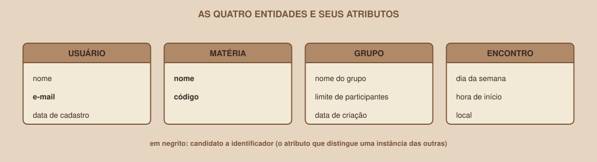

# Módulo 03, Entidades e Atributos

`SEM 04 // Modelagem de Dados`

---

## // Antes de começar

Com o ambiente pronto, começa a parte que dá nome à semana: modelar. Modelar é decidir, antes de escrever qualquer SQL, quais coisas o sistema precisa guardar e quais informações existem sobre cada uma. Este módulo ensina a encontrar essas coisas a partir do que o projeto já diz.

## // O problema: por onde começar?

Existe uma tentação comum: abrir o SQL Editor e começar a criar tabelas pela intuição. O risco é descobrir três módulos depois que uma tabela deveria ter sido duas, e refazer tudo. Modelar primeiro custa alguns minutos de papel e evita esse retrabalho.

## // Entidade e atributo

> **ENTIDADE: EM PALAVRAS SIMPLES**
> É uma "coisa" sobre a qual o sistema precisa guardar informações, e que será, mais adiante, uma tabela. Exemplos: Usuário, Grupo, Matéria.

> **ATRIBUTO: EM PALAVRAS SIMPLES**
> É uma informação sobre uma entidade, e que será, mais adiante, uma coluna. Exemplos: o nome de um usuário, o horário de um encontro.

Cada exemplo concreto de uma entidade (a usuária Ana Martins, o grupo "Modelagem e SQL") se chama **instância**, e será uma linha da tabela.

## // Como descobrir as entidades: leia o que o projeto diz

Uma técnica simples é pegar as histórias de usuário do projeto e sublinhar os substantivos. Considere estas duas:

- "Como estudante, quero buscar grupos pela minha matéria, para encontrar pessoas estudando o mesmo conteúdo."
- "Como estudante, quero ver quando e onde o grupo se encontra, para saber se consigo participar."

Os substantivos que aparecem: **estudante**, **grupo**, **matéria**, **encontro** (o "quando e onde"). Cada um deles é um candidato a entidade. "Estudante" será a entidade Usuário, e os outros três mantêm o nome.

## // Entidade ou atributo? Três perguntas para decidir

Nem todo substantivo vira uma entidade. Alguns são só uma informação sobre outra coisa. Para decidir, pergunte:

1. Existe mais de uma informação sobre isso? (Uma matéria tem nome *e* código.)
2. Esse valor se repete em várias instâncias de outra entidade? (A mesma matéria aparece em vários grupos.)
3. Ele faz sentido existindo sozinho? (Uma matéria pode existir mesmo sem nenhum grupo criado ainda.)

Se as respostas forem "sim", é uma entidade. Se não, é um atributo. É por isso que **Matéria** vira entidade, enquanto o **dia da semana** de um encontro é só um atributo.

## // Os atributos do projeto

| Entidade | Atributos | Candidatos a identificador |
|---|---|---|
| Usuário | nome, e-mail, data de cadastro | e-mail |
| Matéria | nome, código | nome, código |
| Grupo | nome do grupo, limite de participantes, data de criação | (nenhum natural) |
| Encontro | dia da semana, hora de início, local | (nenhum natural) |

Um **identificador** é o atributo (ou conjunto de atributos) que distingue uma instância das outras. Quando nenhum atributo serve bem, como em Grupo, o modelo vai criar um identificador artificial. O Módulo 08 mostra como.

## // Três tipos de atributo que pedem cuidado

**Atributo derivado**: pode ser calculado a partir de outros dados. No `gruposMock` da Semana 03 havia `participantes: 5`, mas esse número pode ser calculado contando as participações de cada grupo. Atributos derivados, em regra, **não** viram coluna.

**Atributo multivalorado**: guarda mais de um valor ao mesmo tempo. No `usuarioMock`, a propriedade `materias: [1, 2, 3]` é um exemplo. Um atributo assim não cabe em uma coluna: ele indica que existe uma relação entre duas entidades, que o próximo módulo vai tratar.

**Atributo composto**: pode ser dividido em partes. Um endereço, por exemplo, tem rua, número e cidade. Quando as partes são consultadas separadamente, cada uma vira uma coluna.

## // Bom exemplo × mau exemplo

**Mau exemplo**: a matéria como um atributo de texto dentro de Grupo:

| Entidade | Atributos |
|---|---|
| Grupo | nome do grupo, matéria, código da matéria, limite de participantes |

O nome e o código da matéria se repetem em cada grupo daquela matéria, e uma matéria sem grupo nem existe no modelo.

**Bom exemplo**: Matéria como entidade própria:

| Entidade | Atributos |
|---|---|
| Matéria | nome, código |
| Grupo | nome do grupo, limite de participantes |

Cada matéria é registrada uma vez. O vínculo entre Grupo e Matéria será desenhado no próximo módulo.

## // Erros comuns

| Erro | Por que acontece | Como corrigir |
|---|---|---|
| Transformar tudo em entidade | Sublinhar substantivos pega palavras demais | Aplique as três perguntas: só vira entidade o que tem informações próprias, se repete ou existe sozinho |
| Guardar um valor que pode ser calculado | O mock já tinha esse campo | Identifique atributos derivados e calcule-os com consulta |
| Colocar uma lista dentro de um atributo | O array do JavaScript permitia isso | Trate como um relacionamento entre duas entidades |
| Misturar dois conceitos em uma entidade | Parece mais simples de início | Se uma parte se repete ou pode existir sozinha, ela merece entidade própria |

## // Prática guiada

1. Pegue duas ou três histórias de usuário do seu projeto (as da Semana 01 servem).
2. Sublinhe os substantivos de cada uma.
3. Para cada substantivo, aplique as três perguntas e decida: entidade, atributo ou nenhum dos dois.
4. Para cada entidade, liste os atributos e proponha um identificador.
5. Marque qualquer atributo derivado ou multivalorado que aparecer.

## // Pratique sozinho

> **DESAFIO**
> Considere este sistema fictício: "Uma biblioteca empresta livros a leitores. Cada livro tem título, autor e ano. Cada empréstimo tem data de retirada e data prevista de devolução." Quais são as entidades e os atributos? Existe algum atributo que você classificaria como derivado?

## // Aplicando no projeto da semana

1. No `docs/arquitetura.md`, crie a seção "Entidades e atributos" com uma tabela no mesmo formato desta seção.
2. Registre, em uma linha, a decisão sobre `participantes` (derivado) e sobre `materias` (multivalorado).
3. Commit: `git commit -m "Documenta entidades e atributos do projeto"`.

## // Checkpoint

> **ANTES DE SEGUIR, PENSE NISTO**
> O `dia_semana` de um encontro deveria ser uma entidade, com uma tabela só para os dias da semana? Aplique as três perguntas.

Resposta: não deveria. O dia da semana tem uma única informação (o próprio nome do dia), não precisa de dados adicionais, e um valor como "segunda-feira" não ganha nada existindo sozinho. É um atributo simples de Encontro. Seria diferente se existissem informações próprias de cada dia, como um horário de funcionamento da universidade.

## // Resumo do módulo

- [ ] Sei diferenciar entidade, atributo e instância.
- [ ] Sei extrair entidades candidatas de histórias de usuário.
- [ ] Sei aplicar as três perguntas para decidir entre entidade e atributo.
- [ ] Sei reconhecer atributos derivados e multivalorados.
- [ ] Já listei as entidades e os atributos do meu projeto.

---

**Próximo módulo:** `04-relacionamentos-e-cardinalidade.md`, as entidades existem. Agora, como elas se ligam entre si.

`Material de Estudo // Coffee & Code`
