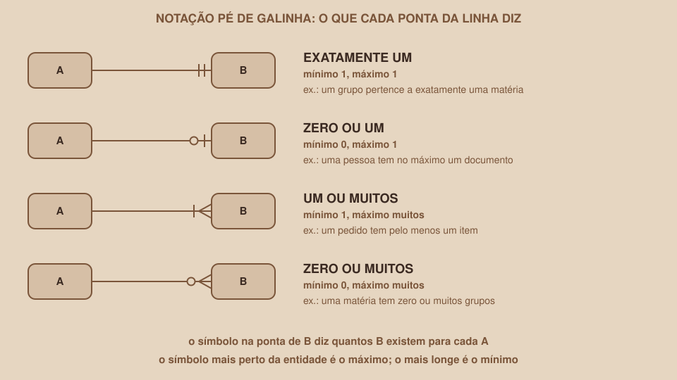

# Módulo 04, Relacionamentos e Cardinalidade

`SEM 04 // Modelagem de Dados`

---

## // Antes de começar

No Módulo 03 você encontrou as entidades do projeto: Usuário, Matéria, Grupo e Encontro. Mas entidades isoladas ainda não dizem nada sobre como as informações se conectam. Este módulo resolve exatamente isso: quais entidades se ligam, e de que forma.

## // O problema: um grupo é de qual matéria?

Com as quatro entidades soltas, o modelo não responde perguntas básicas do projeto. Qual é a matéria de um grupo? Quem participa de um grupo? Quando o grupo se encontra? As respostas estão nas **ligações** entre as entidades, e é preciso desenhá-las com precisão, porque o jeito de ligar decide como as tabelas serão criadas.

## // Relacionamento

> **RELACIONAMENTO: EM PALAVRAS SIMPLES**
> É uma ligação entre duas entidades, normalmente descrita por um verbo. Exemplos: uma Matéria *tem* Grupos; um Usuário *participa de* Grupos.

Para descobrir os relacionamentos, tente formar frases com duas entidades e um verbo:

- Uma matéria **tem** grupos.
- Um grupo **tem** encontros.
- Um usuário **participa de** grupos.

## // Cardinalidade: quantos de cada lado

> **CARDINALIDADE: EM PALAVRAS SIMPLES**
> Diz quantas instâncias de uma entidade podem se ligar a uma instância da outra. A cardinalidade se lê **nos dois sentidos**.

Pegue o relacionamento entre Matéria e Grupo e leia nos dois sentidos:

- Uma matéria pode ter **muitos** grupos (ou nenhum, se ainda não foi criado).
- Um grupo pertence a **exatamente uma** matéria.

Como de um lado o máximo é "um" e do outro é "muitos", esse relacionamento é do tipo **1:N** (um para muitos).

## // Os três tipos de relacionamento

| Tipo | Leitura | Exemplo |
|---|---|---|
| 1:1 | Cada instância de um lado se liga a no máximo uma do outro | Uma pessoa e o seu documento de identidade |
| 1:N | Uma instância de um lado se liga a muitas do outro | Uma matéria e os seus grupos |
| N:N | Muitas de cada lado se ligam a muitas do outro | Usuários e grupos |

O tipo 1:1 é raro e não aparece no projeto desta semana. Os outros dois, sim: Matéria e Grupo é 1:N, Grupo e Encontro é 1:N, e Usuário e Grupo é N:N.

## // Cardinalidade mínima: obrigatório ou opcional?

Além do máximo (um ou muitos), vale perguntar o **mínimo**: a ligação é obrigatória ou opcional?

- Um grupo **precisa** ter uma matéria: a ligação é obrigatória desse lado (mínimo 1).
- Uma matéria **pode** existir sem nenhum grupo: a ligação é opcional desse lado (mínimo 0).

Essa resposta vai virar uma regra concreta do banco no Módulo 08: a referência obrigatória será uma coluna que não aceita valor vazio.

## // A notação pé de galinha

Para desenhar cardinalidades, este guia usa a notação **pé de galinha** (*crow's foot*), muito comum em ferramentas de modelagem. Cada ponta da linha de relacionamento tem um símbolo que diz o mínimo e o máximo daquele lado:

| Símbolo na ponta da linha | Significa |
|---|---|
| Duas barras | Exatamente um |
| Círculo e uma barra | Zero ou um |
| Pé de galinha e uma barra | Um ou muitos |
| Pé de galinha e um círculo | Zero ou muitos |

O truque para ler: o símbolo **mais próximo da entidade** é o máximo (uma barra para "um", o pé de galinha para "muitos"), e o **mais afastado** é o mínimo (uma barra para "obrigatório", o círculo para "opcional").

## // O relacionamento N:N e a tabela associativa

Usuário e Grupo são N:N: uma pessoa participa de vários grupos, e um grupo tem várias pessoas. O problema é que um banco relacional **não consegue** representar N:N diretamente entre duas tabelas. A solução é criar uma terceira entidade no meio, a **entidade associativa**, que quebra o N:N em dois relacionamentos 1:N.

No projeto, essa entidade se chama **Participação**: cada instância dela representa uma pessoa participando de um grupo.

| usuario_id | grupo_id | entrou_em |
|---|---|---|
| 1 | 1 | 2026-09-01 |
| 1 | 2 | 2026-09-03 |
| 2 | 1 | 2026-09-02 |

Repare em duas coisas. Primeiro, cada linha liga uma pessoa a um grupo. Segundo, a coluna `entrou_em` não pertence nem ao usuário nem ao grupo: ela pertence à **ligação** entre os dois. Esse é um sinal clássico de que o relacionamento merece uma entidade própria.

Agora o `usuarioMock.materias: [1, 2, 3]` da Semana 03 faz sentido: aquele array era uma forma disfarçada de guardar o N:N, que o banco guarda em uma tabela de ligação.

## // Os relacionamentos do projeto

| Relacionamento | Lado da esquerda | Lado da direita | Tipo |
|---|---|---|---|
| Matéria tem Grupo | Exatamente uma matéria | Zero ou muitos grupos | 1:N |
| Grupo tem Encontro | Exatamente um grupo | Zero ou muitos encontros | 1:N |
| Usuário tem Participação | Exatamente um usuário | Zero ou muitas participações | 1:N |
| Grupo tem Participação | Exatamente um grupo | Zero ou muitas participações | 1:N |

Os dois últimos juntos formam o N:N entre Usuário e Grupo, resolvido pela Participação.

## // Bom exemplo × mau exemplo

**Mau exemplo**: tentar guardar o N:N dentro de uma das entidades:

| Entidade | Atributos |
|---|---|
| Usuário | nome, e-mail, lista de grupos |

Uma lista dentro de um atributo volta ao problema do Módulo 01: sem como consultar bem, sem como remover uma participação com segurança, e sem lugar para o `entrou_em`.

**Bom exemplo**: uma entidade associativa no meio:

| Entidade | Atributos |
|---|---|
| Usuário | nome, e-mail |
| Grupo | nome do grupo, limite de participantes |
| Participação | data de entrada (ligando um usuário a um grupo) |

## // Erros comuns

| Erro | Por que acontece | Como corrigir |
|---|---|---|
| Ler o relacionamento em um sentido só | Parece suficiente ouvir "uma matéria tem grupos" | Leia sempre nos dois sentidos antes de fixar a cardinalidade |
| Desenhar N:N direto entre duas tabelas | O papel permite, o banco não | Crie a entidade associativa e use dois relacionamentos 1:N |
| Trocar o lado do pé de galinha | O símbolo "muitos" fica do lado de quem é "muitos" | Pergunte: a quantidade de quê? O símbolo fica ao lado dessa entidade |
| Esquecer o mínimo | Só se pensa no "um ou muitos" | Para cada ponta, pergunte se pode ser zero |

## // Prática guiada

1. Para cada par de entidades do seu projeto que tenha ligação, escreva a frase com um verbo.
2. Leia cada frase nos dois sentidos e anote o máximo (um ou muitos) e o mínimo (zero ou um).
3. Classifique cada relacionamento como 1:1, 1:N ou N:N.
4. Para cada N:N, proponha a entidade associativa e liste os atributos que pertencem à ligação.

## // Pratique sozinho

> **DESAFIO**
> Na biblioteca do Módulo 03, "um leitor pega livros emprestados, e um livro pode ser emprestado por vários leitores ao longo do tempo". Que tipo de relacionamento é esse? Que entidade associativa você criaria e quais atributos ela teria?

## // Aplicando no projeto da semana

1. No `docs/arquitetura.md`, crie a seção "Relacionamentos" com uma tabela no formato desta seção.
2. Registre a entidade associativa que resolve o N:N do seu projeto.
3. Commit: `git commit -m "Documenta relacionamentos e cardinalidades"`.

## // Checkpoint

> **ANTES DE SEGUIR, PENSE NISTO**
> No relacionamento 1:N entre Matéria e Grupo, qual das duas tabelas vai guardar a referência para a outra?

Resposta: a tabela do lado "muitos", ou seja, Grupo. Cada grupo guarda o identificador da sua matéria, e isso funciona porque cada grupo tem exatamente uma. O contrário não funcionaria: uma matéria teria que guardar a lista de todos os seus grupos, voltando ao problema da lista dentro de um campo.

## // Resumo do módulo

- [ ] Sei descrever um relacionamento com um verbo e ler a cardinalidade nos dois sentidos.
- [ ] Sei diferenciar 1:1, 1:N e N:N.
- [ ] Sei o que é cardinalidade mínima (obrigatório ou opcional).
- [ ] Sei ler os quatro símbolos da notação pé de galinha.
- [ ] Sei resolver um N:N com uma entidade associativa.
- [ ] Já listei os relacionamentos do meu projeto.

---

**Próximo módulo:** `05-o-diagrama-der.md`, as entidades e as ligações estão definidas. Hora de juntar tudo em um desenho.

`Material de Estudo // Coffee & Code`
