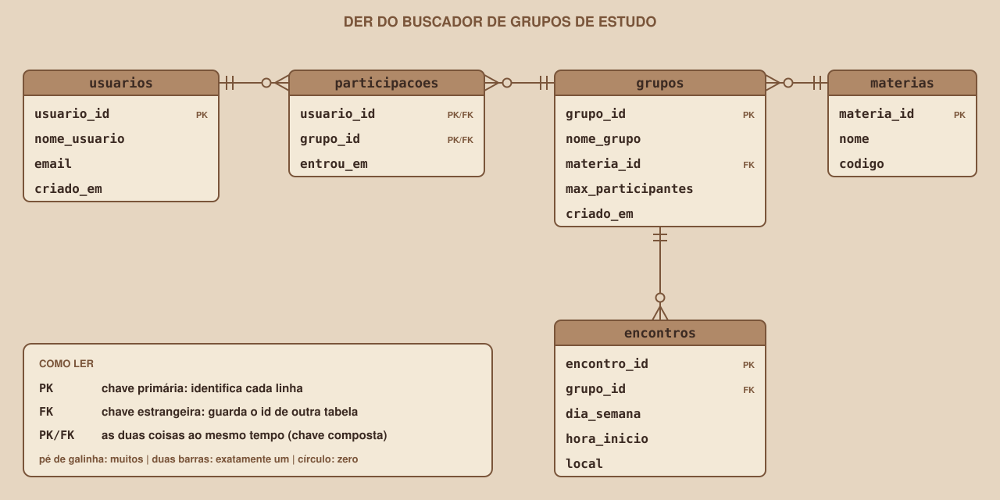

# Module 05, The ER Diagram

🇧🇷 [Português](./05-o-diagrama-der.md) · 🇺🇸 English

`WEEK 04 // Data Modeling`

---

## // Before you start

In Modules 03 and 04 you found the project's entities, attributes and relationships, and wrote everything down in text tables. This module brings it all together in a single drawing, the ERD, which is the central modeling document and the starting point for creating the database.

> **A NOTE ON THE NAME**
> In Portuguese this diagram is called DER (*Diagrama Entidade-Relacionamento*), which is why the file names in this repository use "der". In English it is the ERD (Entity-Relationship Diagram).

## // The problem: text does not show the structure

A list of entities and relationships describes the model, but it does not let you see the whole. In a drawing, a few seconds are enough to notice that Group is at the center of the system, that Membership links two ends, and that Subject depends on nothing. That is why people who work with databases draw diagrams before creating tables.

## // What an ERD is

> **ERD: IN PLAIN WORDS**
> The Entity-Relationship Diagram is a drawing that shows the entities (the future tables), their attributes (the future columns) and the relationships between them, with the cardinality at each end.

In modeling books, the ERD appears at three levels of detail: **conceptual** (only entities and relationships), **logical** (with attributes, keys and cardinalities) and **physical** (with data types and details of the chosen database). This week's ERD is at the **logical** level: it already shows the columns and the keys, but data types only come in Module 08.

## // The elements of an ERD

| Element | How it appears in the drawing |
|---|---|
| Entity | A box with the name at the top |
| Attribute | A line inside the box |
| Primary key | Marked with PK next to the attribute |
| Foreign key | Marked with FK next to the attribute |
| Relationship | A line between the boxes, with the cardinality symbols at the ends |

The **foreign key** (FK) is the column that stores the identifier of another table, and it is what makes the relationship concrete. As you saw in Module 04, it goes in the table on the "many" side. Module 08 explains keys in detail.

## // The Study Group Finder ERD

To check whether the drawing is right, read each relationship line as a sentence, in both directions:

- A subject has zero or many groups; each group belongs to exactly one subject.
- A group has zero or many meetings; each meeting belongs to exactly one group.
- A user has zero or many memberships; each membership belongs to exactly one user.
- A group has zero or many memberships; each membership belongs to exactly one group.

The last two together form the N:N between users and groups.

## // How to draw an ERD, step by step

1. Draw a box for each entity, with the name at the top.
2. Write the attributes inside each box and mark the primary key (PK).
3. For each N:N, add the associative entity between the two boxes.
4. Draw the lines of the 1:N relationships and put, at each end, the cardinality symbol.
5. In the tables on the "many" side, add the foreign key (FK) and mark it.
6. Reread each line as a sentence, in both directions.

## // Tools for drawing

The first ERD can be done on paper, and that is recommended: moving a box is quick, and drawing forces you to think. For the final version, any diagram tool that supports boxes and lines will do (diagrams.net is a free option). Once the tables exist on Supabase, the dashboard can show a schema visualizer that draws the ERD from the real tables. This is useful to check whether the created database matches the drawing (menu names may change over time).

## // Good example × bad example

**Bad example**: N:N drawn directly between user and group, and the subject as text inside the group:

| Entity | Attributes |
|---|---|
| usuarios | usuario_id PK, nome_usuario, email, list of groups |
| grupos | grupo_id PK, nome_grupo, materia (text), codigo_materia |

**Good example**: associative entity in the middle, and the subject in its own table:

| Entity | Attributes |
|---|---|
| usuarios | usuario_id PK, nome_usuario, email, criado_em |
| participacoes | usuario_id PK/FK, grupo_id PK/FK, entrou_em |
| grupos | grupo_id PK, nome_grupo, materia_id FK, max_participantes, criado_em |
| materias | materia_id PK, nome, codigo |

## // Common mistakes

| Mistake | Why it happens | How to fix it |
|---|---|---|
| Forgetting to mark the keys | The drawing looks complete without them | Mark PK and FK in every table before calling the ERD done |
| Putting the FK in the wrong table | Confusion about which side is "many" | The FK goes on the N side of the 1:N relationship |
| Lines crossing for no reason | The boxes were drawn without planning | Move the boxes until the lines are clean |
| Including calculated columns | The mock had the `participantes` field | Do not include derived attributes in the ERD |

## // Guided practice

1. Draw your project's ERD on paper, following the six steps in this section.
2. Mark PK and FK in each table.
3. Put the cardinality symbols at both ends of each relationship.
4. Read each relationship as a sentence, in both directions, and fix any mistake.
5. Make a clean copy of the drawing, on paper or in a diagram tool.

## // Practice on your own

> **CHALLENGE**
> Draw the ERD for the library from the previous modules: readers, books and the associative entity for loans. Include the attributes, the keys and the cardinality at each end.

## // Applying it to the week's project

1. Export your project's ERD as an image and save it as `docs/der.png` (or `.svg`).
2. In `docs/arquitetura.md`, include the image and the four sentences reading the relationships.
3. Commit: `git commit -m "Add the project's ERD"`.

## // Checkpoint

> **BEFORE MOVING ON, THINK ABOUT THIS**
> How many tables will the project's ERD generate, and why is Membership one of them, even though it is not a real-world "thing" like a user or a group?

Answer: five tables (usuarios, materias, grupos, participacoes and encontros). Membership is a table because the relationship between users and groups is N:N, and a relational database only represents N:N with a link table in the middle. Besides that, it stores an attribute that belongs to the link itself, `entrou_em`.

## // Module summary

- [ ] I know what an ERD is and what the logical level means.
- [ ] I know the five elements of an ERD (entity, attribute, PK, FK and relationship).
- [ ] I can draw an ERD in six steps.
- [ ] I can read an ERD as sentences, in both directions.
- [ ] I already have my project's ERD saved in the repository.

---

**Next module:** `06-normalizacao-anomalias-e-1fn.en.md`, the ERD is drawn. Before creating tables, it is worth testing whether the design avoids repetition.

`Study Material // Coffee & Code`
