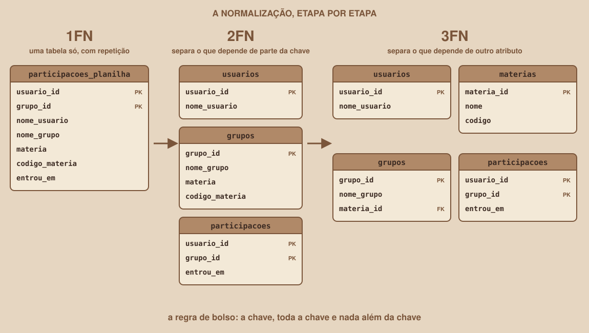

# Módulo 07, Normalização: 2FN e 3FN

`SEM 04 // Modelagem de Dados`

---

## // Antes de começar

No Módulo 06 você viu por que uma tabela única dá problema, e como a 1FN resolve o primeiro nível: cada célula guarda um único valor, sem listas dentro de uma coluna. Só que uma tabela pode estar na 1FN e ainda repetir muita informação. Este módulo resolve exatamente isso, com as duas formas normais seguintes.

## // O ponto de partida: uma tabela na 1FN que ainda repete dados

Esta é a tabela `participacoes_planilha`, que registra quem participa de qual grupo:

| usuario_id | grupo_id | nome_usuario | nome_grupo | materia | codigo_materia | entrou_em |
|---|---|---|---|---|---|---|
| 1 | 10 | Ana Martins | Cálculo passo a passo | Cálculo I | MAT101 | 2026-09-01 |
| 1 | 11 | Ana Martins | Estruturas na prática | Estrutura de Dados | INF201 | 2026-09-03 |
| 2 | 10 | Bruno Lima | Cálculo passo a passo | Cálculo I | MAT101 | 2026-09-02 |
| 3 | 11 | Carla Souza | Estruturas na prática | Estrutura de Dados | INF201 | 2026-09-05 |

A chave primária aqui é **composta**: o par `(usuario_id, grupo_id)` identifica uma linha, porque a mesma pessoa pode participar de vários grupos e um grupo tem várias pessoas.

Repare em quanto texto se repete. O nome "Ana Martins" aparece em duas linhas, e o código MAT101 também. Se Ana mudar de nome, você precisa lembrar de atualizar todas as linhas dela. Se esquecer uma, o banco passa a ter duas versões da mesma pessoa.

## // Dependência funcional: a ideia por trás de tudo

> **DEPENDÊNCIA FUNCIONAL: EM PALAVRAS SIMPLES**
> Dizemos que B depende de A quando, sabendo o valor de A, existe um único valor possível para B. Escrevemos A → B. Exemplo: sabendo o `usuario_id`, existe um único `nome_usuario`.

Aplicando essa pergunta a cada coluna da tabela do exemplo:

| Coluna | Depende de | Depende da chave inteira? |
|---|---|---|
| `nome_usuario` | `usuario_id` | Não, só de parte da chave |
| `nome_grupo` | `grupo_id` | Não, só de parte da chave |
| `materia` | `grupo_id` | Não, só de parte da chave |
| `codigo_materia` | `materia` | Não, depende de outra coluna que não é chave |
| `entrou_em` | `(usuario_id, grupo_id)` | Sim |

Essa tabela é o mapa dos problemas: cada "Não" aponta uma repetição que as próximas seções vão eliminar.

## // 2FN: toda a chave

> **2FN: EM PALAVRAS SIMPLES**
> Uma tabela está na 2FN quando já está na 1FN e todo atributo que não faz parte da chave depende da chave **inteira**, não só de um pedaço dela.

A 2FN só tem o que corrigir quando a chave é composta. Se a chave tem uma única coluna, a tabela já está na 2FN automaticamente, porque não existe "pedaço" de chave.

Como aplicar, em quatro passos:

1. Identifique a chave composta (aqui, `usuario_id` e `grupo_id`).
2. Para cada coluna fora da chave, pergunte: preciso dos dois pedaços da chave para determiná-la, ou só de um?
3. As colunas que dependem de um pedaço só vão para uma tabela nova, que tem esse pedaço como chave.
4. Na tabela original ficam apenas as colunas que dependem da chave inteira.

O resultado da 2FN são três tabelas:

| usuario_id | nome_usuario |
|---|---|
| 1 | Ana Martins |
| 2 | Bruno Lima |
| 3 | Carla Souza |

| grupo_id | nome_grupo | materia | codigo_materia |
|---|---|---|---|
| 10 | Cálculo passo a passo | Cálculo I | MAT101 |
| 11 | Estruturas na prática | Estrutura de Dados | INF201 |

| usuario_id | grupo_id | entrou_em |
|---|---|---|
| 1 | 10 | 2026-09-01 |
| 1 | 11 | 2026-09-03 |
| 2 | 10 | 2026-09-02 |
| 3 | 11 | 2026-09-05 |

O nome de cada pessoa agora existe uma única vez. Mas a tabela `grupos` ainda guarda `materia` e `codigo_materia` juntos, e aí mora o próximo problema.

## // 3FN: nada além da chave

> **3FN: EM PALAVRAS SIMPLES**
> Uma tabela está na 3FN quando já está na 2FN e nenhuma coluna fora da chave depende de outra coluna fora da chave. Em outras palavras: sem dependências transitivas.

Na tabela `grupos`, o `codigo_materia` não depende diretamente de `grupo_id`: ele depende de `materia`, e `materia` depende de `grupo_id`. A informação chega ao grupo "passando por" outra coluna, e isso é uma dependência transitiva (`grupo_id` → `materia` → `codigo_materia`). Se o código de uma matéria mudar, você precisa corrigir todos os grupos daquela matéria.

A correção é a mesma lógica da 2FN: a informação que depende de outra coluna vai para uma tabela própria.

<div align="center">

</div>

Ao final, o modelo do projeto tem quatro tabelas:

```
usuarios(usuario_id PK, nome_usuario)
materias(materia_id PK, nome, codigo)
grupos(grupo_id PK, nome_grupo, materia_id FK)
participacoes(usuario_id PK/FK, grupo_id PK/FK, entrou_em)
```

A tabela `grupos` agora guarda só o `materia_id`, uma referência à matéria. As letras PK e FK significam chave primária e chave estrangeira, que o Módulo 08 explica em detalhe.

## // E o campo `participantes` do mock?

No `gruposMock` da Semana 03, cada grupo tinha uma propriedade `participantes: 5`. Repare que, no modelo normalizado, essa coluna não existe, e de propósito. A quantidade de participantes pode ser **calculada** contando as linhas de `participacoes` de cada grupo.

Guardar o número como coluna criaria uma segunda fonte da verdade, e o banco poderia dizer que o grupo tem 5 participantes enquanto a tabela `participacoes` mostra 4 linhas. É o mesmo problema de dessincronização que você viu no Módulo 13 da Semana 03, agora no banco. O Módulo 11 mostra como calcular o número com `COUNT`.

## // Quando não normalizar

Normalizar reduz a repetição, mas aumenta o número de tabelas, e consultar dados espalhados exige cruzar tabelas (o `JOIN` do Módulo 11). Em sistemas muito focados em leitura e relatórios, às vezes se duplica um dado de propósito, para ganhar velocidade. Isso se chama desnormalização.

A regra desta semana: normalize até a 3FN, e só desnormalize com um motivo medido, nunca por palpite. O Módulo 13 (trilha veterano) mostra como medir.

## // Bom exemplo × mau exemplo

**Mau exemplo**: o código da matéria repetido dentro de cada grupo:

| grupo_id | nome_grupo | materia | codigo_materia |
|---|---|---|---|
| 10 | Cálculo passo a passo | Cálculo I | MAT101 |
| 12 | Revisão de limites | Cálculo I | MAT101 |

Se o código mudar para MAT102, é preciso atualizar as duas linhas, e esquecer uma deixa o banco contraditório.

**Bom exemplo**: a matéria em tabela própria, e o grupo guardando só a referência:

| materia_id | nome | codigo |
|---|---|---|
| 1 | Cálculo I | MAT101 |

| grupo_id | nome_grupo | materia_id |
|---|---|---|
| 10 | Cálculo passo a passo | 1 |
| 12 | Revisão de limites | 1 |

Agora o código existe em um único lugar, e mudá-lo é uma alteração em uma linha só.

## // Erros comuns

| Erro | Por que acontece | Como corrigir |
|---|---|---|
| Procurar o que separar na 2FN de uma tabela com chave de uma coluna só | A 2FN só trata dependência de parte de uma chave composta | Se a chave tem uma coluna só, a tabela já está na 2FN: siga para a 3FN |
| Separar demais, criando uma tabela para cada coluna | A normalização vira meta em vez de ferramenta | Só separe quando houver repetição real ou uma dependência que viole a regra |
| Assumir que `materia` determina `codigo_materia` sempre | A dependência só vale se o nome da matéria for único | Confirme a regra de negócio: se duas matérias de mesmo nome puderem ter códigos diferentes, a dependência não existe |
| Guardar um valor que pode ser calculado, como a contagem de participantes | Parece mais rápido de ler | Calcule com `COUNT`, e só guarde se medir que realmente precisa |

## // Prática guiada

1. Copie a tabela `participacoes_planilha` deste módulo para um editor de texto ou para o papel.
2. Escreva as dependências funcionais, uma por linha, no formato `A → B`.
3. Aplique a 2FN: quais colunas dependem só de `usuario_id`? Quais dependem só de `grupo_id`?
4. Aplique a 3FN na tabela `grupos` que sobrou.
5. Compare o seu resultado com o diagrama deste módulo e anote qualquer diferença.

## // Pratique sozinho

> **DESAFIO**
> A tabela `encontros_planilha` guarda `encontro_id` (chave), `grupo_id`, `nome_grupo`, `dia_semana`, `hora_inicio` e `local`. Existe alguma dependência transitiva? Se existir, escreva como você separaria a tabela.

## // Aplicando no projeto da semana

1. No seu `docs/arquitetura.md`, registre as tabelas e colunas do projeto depois da 3FN, no mesmo formato da lista deste módulo.
2. Reveja o DER que você desenhou no Módulo 05: cada entidade respeita a 2FN e a 3FN? Ajuste o desenho onde não respeitar.
3. Commit: `git commit -m "Normaliza o modelo do projeto até a 3FN"`.

## // Checkpoint

> **ANTES DE SEGUIR, PENSE NISTO**
> A tabela `grupos(grupo_id, nome_grupo, materia_id, nome_materia)` tem chave simples (`grupo_id`). Ela já está na 2FN? E na 3FN?

Resposta: está na 2FN, porque a chave tem uma única coluna e, portanto, nenhuma coluna pode depender de apenas "parte" dela. Mas não está na 3FN: `nome_materia` depende de `materia_id`, que não é a chave, formando a dependência transitiva `grupo_id` → `materia_id` → `nome_materia`. A correção é tirar `nome_materia` de `grupos` e guardá-lo só na tabela `materias`.

## // Resumo do módulo

- [ ] Sei explicar o que é dependência funcional (A → B).
- [ ] Sei identificar quando uma coluna depende só de parte de uma chave composta (violação da 2FN).
- [ ] Sei identificar uma dependência transitiva (violação da 3FN).
- [ ] Sei separar uma tabela para corrigir cada violação.
- [ ] Sei por que o campo `participantes` do mock não deve virar coluna.
- [ ] O modelo do meu projeto está normalizado até a 3FN.

---

**Próximo módulo:** `08-tipos-de-dados-e-chaves.md`, o desenho está normalizado. Hora de definir o tipo de cada coluna e como as tabelas se ligam por chaves.

`Material de Estudo // Coffee & Code`
