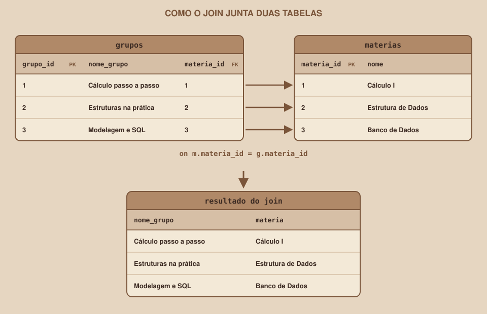

# Módulo 11, SQL: JOIN e Agregações

🇧🇷 Português · 🇺🇸 [English](../docs-eng/11-sql-join-and-aggregations.md)

`SEM 04 // Modelagem de Dados`

---

## // Antes de começar

Normalizar espalhou os dados por cinco tabelas. Isso elimina a repetição, mas cria um novo problema: quase toda pergunta interessante precisa de dados de mais de uma tabela. O `join` é o comando que junta as tabelas de volta, e as agregações são o que calcula números como a quantidade de participantes, o campo que sumiu do `gruposMock`.

## // O problema: o Dashboard precisa de dados de vários lugares

Para mostrar um card do Dashboard, a Semana 03 usava um objeto com tudo junto: nome do grupo, matéria e quantidade de participantes. No banco, o nome do grupo está em `grupos`, o nome da matéria está em `materias`, e a quantidade de participantes nem existe como dado: ela precisa ser calculada em `participacoes`. Reunir isso é o trabalho do `join` e do `count`.

## // `join`: juntando tabelas pela chave

> **JOIN: EM PALAVRAS SIMPLES**
> É a operação que combina linhas de duas tabelas quando uma condição é verdadeira. Quase sempre, a condição compara uma chave estrangeira com a chave primária que ela aponta.

<div align="center">

</div>

```sql
select g.nome_grupo, m.nome as materia, m.codigo
from grupos g
join materias m on m.materia_id = g.materia_id
order by m.nome;
```

```
       nome_grupo       |        materia         | codigo
------------------------+------------------------+--------
 Modelagem e SQL        | Banco de Dados         | INF301
 Cálculo passo a passo  | Cálculo I              | MAT101
 Requisitos e histórias | Engenharia de Software | INF305
 Estruturas na prática  | Estrutura de Dados     | INF201
 Redes na unha          | Redes de Computadores  | INF310
 Processos e memória    | Sistemas Operacionais  | INF315
```

Três detalhes da sintaxe:

- `join materias m on ...`: junta a tabela `materias`, que passa a ser chamada de `m` (um **apelido**, para escrever menos).
- `on m.materia_id = g.materia_id`: a condição que liga as duas tabelas, a chave primária de um lado e a chave estrangeira do outro.
- `m.nome as materia`: o `as` dá um nome novo à coluna no resultado.

## // `join` e `left join`: o que acontece sem correspondência

O `join` comum só devolve as linhas que têm correspondência nos dois lados. O `left join` mantém **todas as linhas da tabela da esquerda**, mesmo quando não existe correspondência, e preenche com vazio o que faltar.

Imagine que existe a matéria "Cálculo II", ainda sem nenhum grupo. Contando grupos por matéria:

```sql
-- join: a matéria sem grupo desaparece do resultado
select m.nome as materia, count(g.grupo_id) as grupos
from materias m
join grupos g on g.materia_id = m.materia_id
group by m.nome order by m.nome;
```

```sql
-- left join: a matéria sem grupo aparece, com 0
select m.nome as materia, count(g.grupo_id) as grupos
from materias m
left join grupos g on g.materia_id = m.materia_id
group by m.nome order by m.nome;
```

No segundo resultado, aparece uma linha a mais: `Cálculo II` com `0` grupos. Se a pergunta é "quantos grupos cada matéria tem, inclusive as que não têm nenhum", o `left join` é o certo.

## // Agregações: calculando números

> **AGREGAÇÃO: EM PALAVRAS SIMPLES**
> É um cálculo que resume várias linhas em um único valor, como contar, somar ou achar o maior. As funções mais usadas são `count`, `sum`, `avg`, `min` e `max`.

```sql
select count(*) as total, min(entrou_em) as primeira, max(entrou_em) as ultima
from participacoes;
```

```
 total |  primeira  |   ultima
-------+------------+------------
    16 | 2026-09-01 | 2026-09-13
```

### > `group by`: um resultado por grupo

Para calcular um valor para cada grupo, em vez de um só para a tabela inteira, use `group by`. Esta é a consulta que devolve o campo `participantes` que sumiu do mock:

```sql
select g.grupo_id, g.nome_grupo, count(p.usuario_id) as participantes
from grupos g
left join participacoes p on p.grupo_id = g.grupo_id
group by g.grupo_id, g.nome_grupo
order by participantes desc, g.nome_grupo;
```

```
 grupo_id |       nome_grupo       | participantes
----------+------------------------+---------------
        3 | Modelagem e SQL        |             6
        1 | Cálculo passo a passo  |             3
        2 | Estruturas na prática  |             2
        5 | Redes na unha          |             2
        4 | Requisitos e histórias |             2
        6 | Processos e memória    |             1
```

A regra do `group by`: toda coluna do `select` que não esteja dentro de uma função de agregação precisa aparecer também no `group by`.

### > `having`: filtrando depois de agregar

O `where` filtra as linhas **antes** de agrupar. Para filtrar pelo resultado do cálculo, como "só os grupos com 3 participantes ou mais", use `having`:

```sql
select g.nome_grupo, count(p.usuario_id) as participantes
from grupos g
left join participacoes p on p.grupo_id = g.grupo_id
group by g.grupo_id, g.nome_grupo
having count(p.usuario_id) >= 3;
```

## // Vagas restantes: o cálculo que o Dashboard precisa

Juntando tudo, esta consulta devolve, para cada grupo, o limite, quantos participam e quantas vagas sobram:

```sql
select g.nome_grupo,
       g.max_participantes,
       count(p.usuario_id) as participantes,
       g.max_participantes - count(p.usuario_id) as vagas
from grupos g
left join participacoes p on p.grupo_id = g.grupo_id
group by g.grupo_id, g.nome_grupo, g.max_participantes
order by vagas desc, g.nome_grupo;
```

```
       nome_grupo       | max_participantes | participantes | vagas
------------------------+-------------------+---------------+-------
 Redes na unha          |                 6 |             2 |     4
 Cálculo passo a passo  |                 6 |             3 |     3
 Estruturas na prática  |                 5 |             2 |     3
 Processos e memória    |                 4 |             1 |     3
 Requisitos e histórias |                 5 |             2 |     3
 Modelagem e SQL        |                 8 |             6 |     2
```

## // O Perfil em SQL: três tabelas juntas

A tela de Perfil da Semana 03 mostrava os grupos de uma pessoa, com a matéria de cada um. Em SQL, isso é um `join` encadeado, que passa pelas quatro tabelas:

```sql
select u.nome_usuario, g.nome_grupo, m.nome as materia, p.entrou_em
from usuarios u
join participacoes p on p.usuario_id = u.usuario_id
join grupos g        on g.grupo_id   = p.grupo_id
join materias m      on m.materia_id = g.materia_id
where u.email = 'ana.martins@exemplo.com'
order by p.entrou_em;
```

```
 nome_usuario |      nome_grupo       |      materia       | entrou_em
--------------+-----------------------+--------------------+------------
 Ana Martins  | Cálculo passo a passo | Cálculo I          | 2026-09-01
 Ana Martins  | Estruturas na prática | Estrutura de Dados | 2026-09-03
 Ana Martins  | Modelagem e SQL       | Banco de Dados     | 2026-09-05
```

## // O que o `map`, o `reduce` e companhia viram em SQL

| JavaScript (Semana 03) | SQL |
|---|---|
| `grupos.map(g => g.materia)` (escolher campos) | `select coluna1, coluna2` |
| Procurar a matéria de cada grupo em outro array | `join ... on ...` |
| `lista.length` ou `reduce` para contar | `count(...)` |
| Somar ou achar o maior valor | `sum(...)`, `max(...)` |
| Agrupar itens por uma propriedade | `group by ...` |

## // Bom exemplo × mau exemplo

**Mau exemplo**: `count(*)` junto com `left join`:

```sql
select g.nome_grupo, count(*) as participantes
from grupos g
left join participacoes p on p.grupo_id = g.grupo_id
group by g.nome_grupo;
```

Para um grupo sem nenhum participante, o `left join` devolve **uma** linha (com `p` vazio), e o `count(*)` conta essa linha. O resultado é `1`, quando o certo seria `0`.

**Bom exemplo**: contar uma coluna da tabela da direita:

```sql
select g.nome_grupo, count(p.usuario_id) as participantes
from grupos g
left join participacoes p on p.grupo_id = g.grupo_id
group by g.nome_grupo;
```

O `count(coluna)` ignora valores vazios, então o grupo sem participantes aparece com `0`. Testado com um grupo vazio, o `count(*)` devolveu `1`, e o `count(p.usuario_id)`, `0`.

## // Erros comuns

| Erro | Por que acontece | Como corrigir |
|---|---|---|
| Esquecer o `on` e o resultado ter 36 linhas em vez de 6 | Sem condição, o banco combina cada linha de uma tabela com todas as da outra (6 grupos vezes 6 matérias) | Todo `join` precisa do seu `on` |
| `column "g.nome_grupo" must appear in the GROUP BY clause or be used in an aggregate function` | Uma coluna fora da agregação não está no `group by` | Acrescente a coluna ao `group by` |
| `column reference "materia_id" is ambiguous` | A coluna existe nas duas tabelas do `join` | Escreva `g.materia_id` ou `m.materia_id`, com o apelido |
| Usar `count(*)` com `left join` | Conta a linha "vazia" gerada pelo `left join` | Conte uma coluna da tabela da direita |
| Trocar `where` por `having` | Os dois filtram, mas em momentos diferentes | `where` filtra linhas antes de agrupar, `having` filtra os grupos depois |

## // Prática guiada

1. Rode a consulta de `join` entre `grupos` e `materias` e confira o resultado.
2. Rode a consulta de participantes por grupo e compare com o `participantes` do `gruposMock`: os números são diferentes de propósito, e por quê?
3. Rode a consulta de vagas restantes.
4. Escreva a consulta do Perfil para outra pessoa, trocando o e-mail.
5. Remova o `on` de um `join` e observe o tamanho do resultado.

## // Pratique sozinho

> **DESAFIO**
> Escreva uma consulta que mostre, para cada matéria, quantas participações ela tem no total (somando todos os grupos dela). Dica: você vai precisar juntar `materias`, `grupos` e `participacoes`.

## // Aplicando no projeto da semana

1. Salve as consultas do seu projeto em `sql/03-consultas.sql`, com um comentário explicando cada uma.
2. Inclua pelo menos uma consulta com `join`, uma com `group by` e uma com `left join`.
3. Commit: `git commit -m "Adiciona as consultas do projeto"`.

## // Checkpoint

> **ANTES DE SEGUIR, PENSE NISTO**
> Um grupo novo ainda não tem participantes. A sua consulta de "participantes por grupo" usa `join` comum, em vez de `left join`. O que o Dashboard vai mostrar para esse grupo?

Resposta: nada, o grupo some do resultado. O `join` comum só devolve linhas que têm correspondência nos dois lados, e um grupo sem participações não tem nenhuma linha em `participacoes`. Para que ele apareça com `0` participantes, a consulta precisa de `left join` a partir da tabela `grupos`.

## // Resumo do módulo

- [ ] Sei juntar tabelas com `join` e escrever a condição `on` com chave primária e estrangeira.
- [ ] Sei a diferença entre `join` e `left join`.
- [ ] Sei usar `count`, `sum`, `min` e `max`, e `group by`.
- [ ] Sei filtrar o resultado de uma agregação com `having`.
- [ ] Sei por que `count(*)` engana quando há `left join`.
- [ ] Já escrevi as consultas do meu projeto.

---

**Próximo módulo:** `12-projeto-guiado.md`, as ferramentas estão completas. Hora de juntar tudo e deixar o banco ativo no Supabase.

`Material de Estudo // Coffee & Code`
