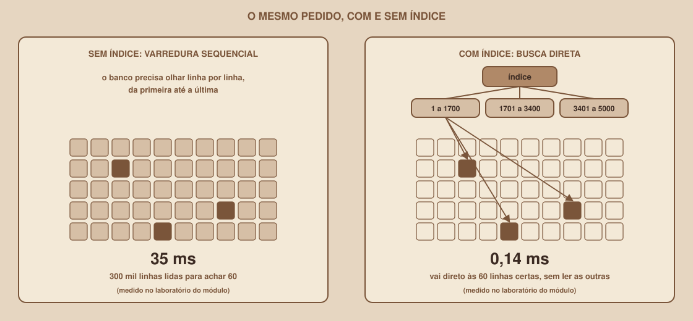

# Module 13, Indexes and Performance

🇧🇷 [Português](./13-indices-e-desempenho.md) · 🇺🇸 English

`WEEK 04 // Data Modeling`

---

## // Before you start

> **VETERAN TRACK**
> This module is part of the veteran track: it comes after the essential content and is not needed for the week's deliverable. If you follow the main track, you can skip to `entregavel.en.md`.

With the database working and the data inside, a new question comes up: does it stay fast when the tables grow? This module teaches you how to measure a query's time, how to read the execution plan PostgreSQL chooses and how to create indexes that speed up searches.

## // The problem: what is fast with 16 rows can be slow with 300 thousand

With the example data, any query answers instantly, because the `participacoes` table has 16 rows. But imagine the Study Group Finder working for real, with thousands of people and hundreds of thousands of memberships. The query that lists the people in a group needs to find the right rows among all the others, and without help the database only knows one thing: look at them one by one.

## // What an index is

> **INDEX: IN PLAIN WORDS**
> It is an auxiliary structure, stored separately, that the database consults to find rows without having to read the whole table. It works like the index at the back of a book: instead of flipping through every page looking for a topic, you go straight to the pages listed.

<div align="center">

</div>

The most common index type in PostgreSQL is the **B-tree**, which keeps the values sorted and lets you find one of them in a few steps, even in huge tables.

## // Which indexes PostgreSQL already creates, and which it does not

| Situation | Index created automatically? |
|---|---|
| Primary key (`primary key`) | Yes |
| `unique` constraint | Yes |
| Foreign key (`references`) | **No** |

The last item is the one that surprises people the most: declaring a foreign key guarantees integrity, but does **not speed up** searches by that column. If the Dashboard filters memberships by `grupo_id`, that column needs its own index.

## // Measure before optimizing: `explain` and `explain analyze`

To find out how the database runs a query, put `explain analyze` in front of it:

```sql
explain analyze
select * from participacoes where grupo_id = 123;
```

The result is the **execution plan**: the list of steps the database followed, with the real time of each one. The parts that matter when you are starting to read a plan:

| Part of the plan | What it means |
|---|---|
| `Seq Scan` | Sequential scan: it read the whole table |
| `Index Scan` or `Bitmap Index Scan` | It used an index to go straight to the rows |
| `Rows Removed by Filter` | How many rows were read and discarded |
| `Execution Time` | Real total time, in milliseconds |

> **CAREFUL WITH `EXPLAIN ANALYZE`**
> `explain analyze` really **runs** the query. With a `select` this is harmless, but with `update` or `delete` the changes actually happen. To rehearse commands that change data, wrap them in `begin;` and end with `rollback;`.

## // The experiment: 300 thousand rows, with and without an index

The file `example/sql/05-laboratorio-indices.sql` sets up a lab in a separate schema, called `lab`, so it does not mix with your project's tables. It creates a table similar to `participacoes`, with 300 thousand rows and no index, and runs the same search before and after creating the index.

**Without an index**, the plan shows a sequential scan:

```
Parallel Seq Scan on participacoes_teste  (actual time=0.088..25.269 rows=30 loops=2)
  Filter: (grupo_id = 123)
  Rows Removed by Filter: 149970
Execution Time: 35.464 ms
```

The database read about 300 thousand rows to return 60. After creating the index:

```sql
create index idx_lab_grupo_id on lab.participacoes_teste (grupo_id);
```

**With an index**, the plan changes:

```
Bitmap Heap Scan on participacoes_teste  (actual time=0.035..0.126 rows=60 loops=1)
  ->  Bitmap Index Scan on idx_lab_grupo_id  (actual time=0.025..0.025 rows=60 loops=1)
Execution Time: 0.142 ms
```

In this test, the same query dropped from about 35 ms to about 0.14 ms. The numbers change from computer to computer, and what matters is the proportion: the index replaced reading 300 thousand rows with going straight to the right 60.

When you finish the experiment, delete the lab:

```sql
drop schema lab cascade;
```

## // The project's indexes

The file `example/sql/04-indices.sql` creates the indexes that make sense for the Study Group Finder:

```sql
create index idx_grupos_materia_id      on grupos (materia_id);
create index idx_participacoes_grupo_id on participacoes (grupo_id);
create index idx_encontros_grupo_id     on encontros (grupo_id);
create index idx_grupos_nome_lower      on grupos (lower(nome_grupo));
```

The first three index foreign keys, which PostgreSQL does not index on its own. The `participacoes` table already has the primary key index `(usuario_id, grupo_id)`, and it works for searching by `usuario_id`, the first column of the pair, but does not help when searching only by `grupo_id`. That is why the second index exists.

The fourth is an **expression index**: it stores the result of `lower(nome_grupo)`, and speeds up case-insensitive searches. In a table with 5 thousand groups, the search `where lower(nome_grupo) = 'grupo 123'` went from a sequential scan (about 1.8 ms) to an `Index Scan` (about 0.04 ms).

## // When the index does not help

An index is not a universal cure, and creating them without criteria has a cost:

- **When almost all rows match the filter.** In a test with `where max_participantes = 50`, in which all 5 thousand groups had that value, the database ignored the index and did a sequential scan, because reading everything directly was cheaper than going through the index.
- **In small tables.** With few rows, the sequential scan is so fast that the database does not even consider the index.
- **In "contains" searches with a leading wildcard**, like `ilike '%sql%'`. The B-tree index does not help when the start of the text is unknown (there are other index types for this, which are out of scope this week).
- **The cost of writes and space.** Each index has to be updated on every `insert`, `update` and `delete`, and it takes up space. In the lab, the 300-thousand-row table took 13 MB, and the index on `grupo_id` took about 2 MB.

The rule of thumb: **measure first** with `explain analyze`, create the index for the query that is really slow, and measure again.

## // Good example × bad example

**Bad example**: creating an index on every column "just in case":

```sql
create index on participacoes (entrou_em);
create index on grupos (criado_em);
create index on usuarios (nome_usuario);
```

Each of these indexes makes writes slower and takes up space, without any known query needing them.

**Good example**: measure, identify the slow query and create the specific index:

```sql
explain analyze select * from participacoes where grupo_id = 123;
-- Seq Scan, 35 ms: confirms the problem
create index idx_participacoes_grupo_id on participacoes (grupo_id);
explain analyze select * from participacoes where grupo_id = 123;
-- Bitmap Index Scan, 0.14 ms: confirms the improvement
```

## // Common mistakes

| Mistake | Why it happens | How to fix it |
|---|---|---|
| Thinking the foreign key creates an index | The primary key and `unique` do, and the foreign key seems to belong to the same family | Create indexes for foreign keys used in filters and `join` |
| The index exists, but the plan shows `Seq Scan` | Small table, unselective filter or outdated statistics | Run `analyze` on the table and test with more data |
| Running `explain analyze` on a `delete` and losing data | The command really runs | Wrap it in `begin;` and `rollback;` |
| Creating an index for an `ilike '%text%'` search | The leading wildcard prevents the B-tree index from being used | Use another index type, or rethink the search |
| Comparing times from a single run | The first result can be influenced by caching | Run it a few times and compare the order of magnitude |

## // Guided practice

1. Run `05-laboratorio-indices.sql` in the SQL Editor, step by step.
2. Compare the two execution plans and identify, in each one, the scan type and the `Execution Time`.
3. Write down the size of the table and of the index.
4. Delete the lab with `drop schema lab cascade;`.

## // Practice on your own

> **CHALLENGE**
> In the lab, before deleting the schema, create an index on `usuario_id` and compare the plan for `select * from lab.participacoes_teste where usuario_id = 777;` before and after. Then create an index on `entrou_em` and test `where entrou_em = '2026-01-10'`: does the database use the index? Why?

## // Applying it to the week's project

1. Run `04-indices.sql` on the project's database and confirm, in the Table Editor or with a query on `pg_indexes`, that the indexes were created.
2. Record in `docs/arquitetura.md` which indexes exist and why each one was created.
3. Commit: `git commit -m "Add the project's indexes"`.

## // Checkpoint

> **BEFORE MOVING ON, THINK ABOUT THIS**
> You run `explain analyze` on the project's database, with the example's 16 memberships, and the plan shows `Seq Scan` even after creating the index on `grupo_id`. Is the index wrong?

Answer: not necessarily. With a tiny table, reading everything directly is cheaper than going through the index, and the database chooses the sequential scan for that reason. The index starts to make a difference when the table grows. To see the effect, you need to test with many rows, as in this module's lab.

## // Module summary

- [ ] I can explain what an index is and when it helps.
- [ ] I know PostgreSQL creates an index for the primary key and `unique`, but not for foreign keys.
- [ ] I can use `explain analyze` and read the main parts of the plan.
- [ ] I can create a simple index and an expression index.
- [ ] I know the cases where an index does not help and the cost of having too many indexes.

---

**Next module:** `14-migrations.en.md`, the database is fast. Now, how to change its structure over time without losing data.

`Study Material // Coffee & Code`
