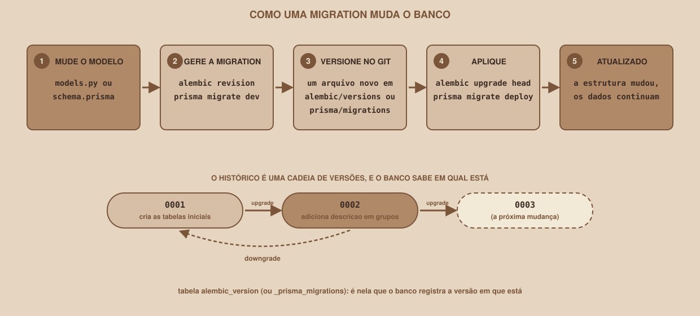

# Module 14, Migrations

🇧🇷 [Português](./14-migrations.md) · 🇺🇸 English

`WEEK 04 // Data Modeling`

---

## // Before you start

> **VETERAN TRACK**
> This module is part of the veteran track: it comes after the essential content and is not needed for the week's deliverable. If you follow the main track, you can skip to `entregavel.en.md`.

In Module 09 you created the database by running a script. That works once. But projects change: tomorrow someone will want a `descricao` (description) column in the groups, and the database already has data that cannot be deleted. This module teaches you how to change the database structure in a controlled, versioned and reversible way.

## // The problem: how do you change a database that already has data?

`drop table` followed by a new `create table` worked while the database was empty. With real data, it is unthinkable: deleting the table deletes everything people registered. Module 09's `alter table` solves the command itself, but leaves three questions open:

- How do you know, a month from now, **which changes** have already been applied to this database?
- How do you apply **exactly the same changes**, in the same order, to another database (a test one, for example)?
- How do you **undo** a change that went wrong?

## // What a migration is

> **MIGRATION: IN PLAIN WORDS**
> It is a file, kept in the repository, that describes a change to the database schema: how to apply it (`upgrade`) and how to undo it (`downgrade`). Each migration has a version number, and together they form the history of how the database reached its current state.

<div align="center">

</div>

The database itself keeps track of which version it is at, in a control table (`alembic_version` in Alembic, `_prisma_migrations` in Prisma). When applying migrations, the tool checks that table and runs only the ones still missing.

## // Two tools, the same idea

| | Alembic (Python) | Prisma Migrate (TypeScript) |
|---|---|---|
| Where you describe the model | `models.py` | `schema.prisma` |
| Generating the migration | `alembic revision --autogenerate` | `prisma migrate dev` |
| Where the files live | `alembic/versions/` | `prisma/migrations/` |
| Applying | `alembic upgrade head` | `prisma migrate deploy` |
| Undoing | `alembic downgrade -1` | There is no equivalent command (you create a new migration) |

Both run the same cycle: you change the model, the tool compares the model with the database and writes the migration for you. Module 15 explains the models; here the focus is the cycle.

> **BEFORE ANYTHING ELSE: USE A TEST DATABASE**
> This module's examples change the database structure. Do them in a **database separate** from your deliverable's database: a local PostgreSQL or a second Supabase project (check, on the pricing page, how many free projects your account allows). That way, a mistake never reaches the database you are going to submit.

## // Alembic, in practice

The commands below were run against a test PostgreSQL. The files are in `example/sqlalchemy/`.

### > 1. Setup (once)

```
pip install -r requirements.txt
alembic init alembic
```

`alembic init` creates the `alembic.ini` file and the `alembic/` folder. Two changes to `alembic/env.py` connect Alembic to your project: telling it which model to use (`target_metadata = Base.metadata`, imported from `models.py`) and reading the database URL from an environment variable, instead of writing it in the file. The example's `env.py` already has these changes.

### > 2. The initial migration

With the database empty and `models.py` ready, Alembic compares the two and writes the migration by itself:

```
alembic revision --autogenerate -m "cria as tabelas iniciais"
```

```
Detected added table 'usuarios'
Detected added table 'grupos'
Detected added index 'idx_grupos_materia_id' on '('materia_id',)'
...
Generating alembic/versions/93fcab46a778_cria_as_tabelas_iniciais.py ... done
```

(The message "cria as tabelas iniciais" means "creates the initial tables"; it is kept in Portuguese to match the file in `example/`.)

The generated file has two functions, `upgrade` (creates the tables) and `downgrade` (deletes them). To apply it:

```
alembic upgrade head
```

```
Running upgrade  -> 93fcab46a778, cria as tabelas iniciais
```

`head` means "the most recent version". After that, the database has the project's five tables, plus the `alembic_version` table, and the `alembic check` command confirms that the model and the database are the same (`No new upgrade operations detected`).

### > 3. Changing the schema: the `descricao` column

Now the real change. In `models.py`, add a line to the `Grupo` class:

```python
descricao: Mapped[str | None] = mapped_column(Text)
```

`str | None` indicates that the column accepts an empty value, which is required here: the rows that already exist have no description. Generate and apply the second migration:

```
alembic revision --autogenerate -m "adiciona descricao em grupos"
alembic upgrade head
```

```
Detected added column 'grupos.descricao'
Running upgrade 93fcab46a778 -> 493b688f9baa, adiciona descricao em grupos
```

The body of the generated migration is small and readable:

```python
def upgrade() -> None:
    op.add_column('grupos', sa.Column('descricao', sa.Text(), nullable=True))


def downgrade() -> None:
    op.drop_column('grupos', 'descricao')
```

Checking the data: the group "Cálculo passo a passo", which already existed, is still there, now with the `descricao` column empty. It was a structure change, with no data loss.

### > 4. The history and `downgrade`

```
alembic history
```

```
93fcab46a778 -> 493b688f9baa (head), adiciona descricao em grupos
<base> -> 93fcab46a778, cria as tabelas iniciais
```

To undo the last migration:

```
alembic downgrade -1
```

```
Running downgrade 493b688f9baa -> 93fcab46a778, adiciona descricao em grupos
```

The `descricao` column disappears, and the groups remain. But keep this warning in mind: the `downgrade` of a column deletes **the contents of that column**. If someone had already filled in descriptions, they would be lost. Undoing a migration is safe for the structure, not for the data it held.

## // Prisma Migrate, in short

Prisma's cycle is the same, with other names. You change `schema.prisma` (for example, adding `descricao String?` to the `Grupo` model) and run:

```
npx prisma migrate dev --name adiciona_descricao
```

The command compares the model with the database, creates a new folder in `prisma/migrations/` with the SQL for the change, applies it to the development database and regenerates the client. In an environment that is not development, the command to apply already created migrations is `prisma migrate deploy`.

> **WARNING: THIS PART WAS NOT RUN BY THE AUTHOR**
> The environment in which this material was produced could not download the Prisma engine, so `migrate dev` and `generate` **were not tested**. What is here follows the official Prisma 7 documentation, checked on October 4, 2026. Run the steps on your machine and, if something differs, follow the official documentation.

> **THE DANGER OF `MIGRATE DEV` ON A DATABASE WITH DATA**
> If Prisma detects that the database has structures that did not come from its migrations (like the tables created by the SQL script from Module 09), `migrate dev` may propose **resetting the database**, which deletes all data. If that question shows up, stop and answer no. That is why a separate test database is essential.

## // Connecting to Supabase: which URL to use

If your test database is a Supabase project, the official documentation (checked on October 4, 2026) distinguishes three ways of connecting, and for migrations the choice matters:

| Connection | Port | When to use it |
|---|---|---|
| Direct | 5432 | Migrations, `pg_dump` and long-running processes. By default, it uses IPv6 only |
| Session pooler | 5432 | When your network is IPv4-only and you need the same purpose as the direct connection |
| Transaction pooler | 6543 | Serverless and short-lived applications, not migrations |

In short: **for migrations, use the direct connection, or the Session pooler if your network has no IPv6.** Do not use the Transaction pooler for them. The **Connect** button in the dashboard shows the three strings. And Module 02's rule still applies: the string has the password, so it goes in `.env`, and never in the repository.

## // Good example × bad example

**Bad example**: changing the structure directly in the Table Editor, or editing a migration that has already been applied:

Changing the database with clicks leaves the history with no record of the change. And editing the file of a migration that has already run on some database makes that database and the file tell different stories.

**Good example**: a new migration for each change, always versioned:

```
alembic/versions/
├── 93fcab46a778_cria_as_tabelas_iniciais.py
└── 493b688f9baa_adiciona_descricao_em_grupos.py
```

Each change is a new file, which goes into Git along with the model change, and the chain of versions tells the complete history of the database.

## // Common mistakes

| Mistake | Why it happens | How to fix it |
|---|---|---|
| `alembic revision --autogenerate` generates an empty migration | `target_metadata` is not pointing to `Base.metadata` | Check the `models.py` import in `env.py` |
| A new required (`not null`) column breaks the migration | The rows that already exist have no value for it | Create the column accepting empty values, fill in the data and only then make it required, or set a default value |
| The database is at a version the history does not know | Someone changed the structure without going through migrations | Use `alembic history` and `alembic current` to compare, and redo the change through a migration |
| `migrate dev` proposes resetting the database | The database has structures that did not come from Prisma's migrations | Answer no, and use a separate test database |
| Editing an old migration | It seems simpler than creating a new one | Never edit a migration that has already been applied: create a new one |
| Connection refused when using Supabase's direct URL | The direct connection is IPv6-only by default | Use the Session pooler string (port 5432) |

## // Guided practice

1. Create a test database (local or a second Supabase project) and keep the URL in `.env`.
2. In `example/sqlalchemy/`, run `alembic upgrade head` and check the five tables.
3. Add `descricao` to `Grupo`, generate the second migration and apply it.
4. Run `alembic history` and `alembic current`, and write down the two versions.
5. Run `alembic downgrade -1` and check that the column disappeared and the group data remains.

## // Practice on your own

> **CHALLENGE**
> Create a third migration that adds the column `ativo boolean not null default true` to the `usuarios` table. Apply it, check that the users who already existed got the value `true`, and then undo it with `downgrade`.

## // Applying it to the week's project

1. Add the migrations folder (`alembic/` or `prisma/migrations/`) to your repository, with your project's initial migration.
2. In `docs/arquitetura.md`, record which tool you used and the command to apply the migrations from scratch.
3. Commit: `git commit -m "Add the project's migration history"`.

## // Checkpoint

> **BEFORE MOVING ON, THINK ABOUT THIS**
> You applied migration 0002 (which creates a column) to the test database and it worked. Before applying it to the deliverable's database, you notice you got the column type wrong. What is the right path: edit the 0002 migration file and run it again?

Answer: no. The 0002 file has already been applied to a database, and editing it makes the history and the database diverge. The right path is, on the test database, to `downgrade` to before 0002, fix the model and generate the migration again. If the migration were already in use on other databases, the path would be to create a 0003 that fixes the column.

## // Module summary

- [ ] I can explain what a migration is, and what `upgrade` and `downgrade` do.
- [ ] I know the cycle: change the model, generate the migration, version it, apply it.
- [ ] I can use `alembic revision --autogenerate`, `upgrade`, `downgrade`, `history` and `current`.
- [ ] I know why the `downgrade` of a column deletes its contents.
- [ ] I know which Supabase connection to use for migrations.
- [ ] I know I should use a test database separate from the deliverable's database.

---

**Next module:** `15-orms-prisma-e-sqlalchemy.en.md`, the database history is under control. What is left is seeing how to use the database from code.

`Study Material // Coffee & Code`
